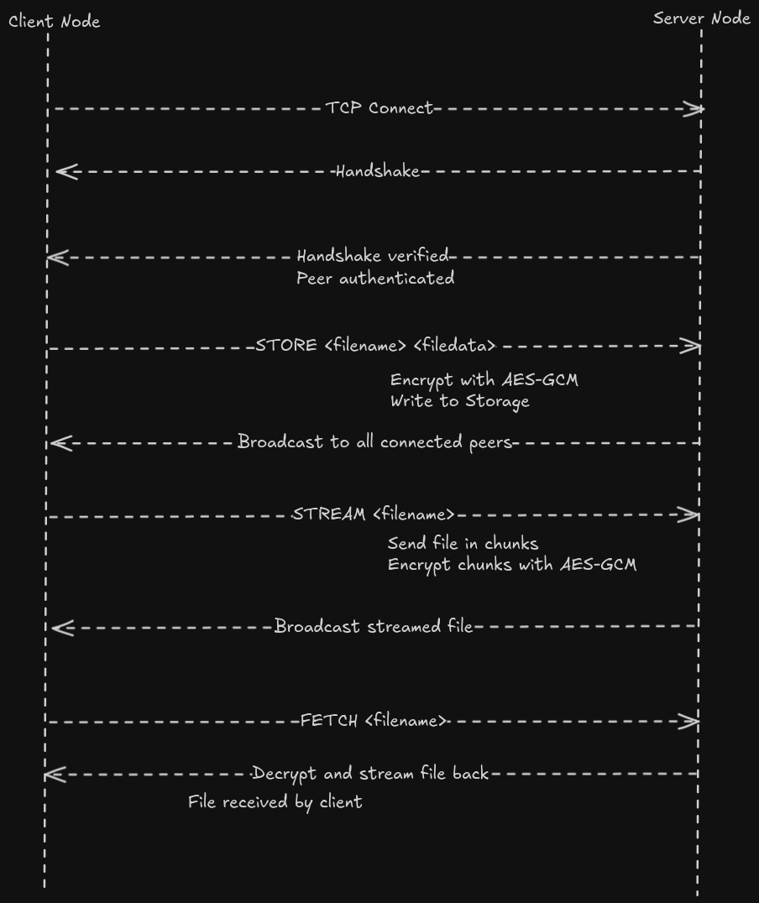
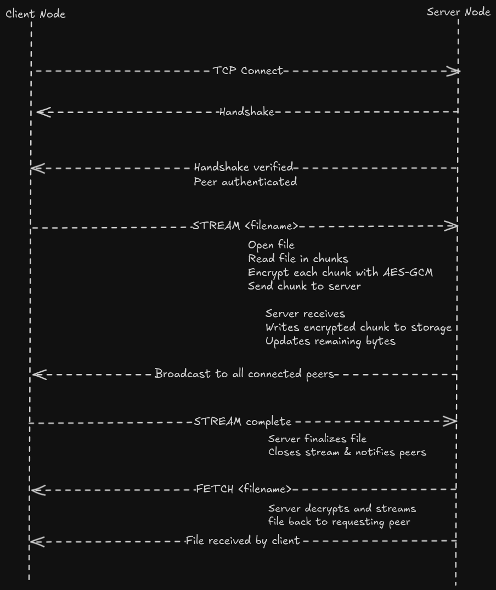

# BitBuddies

**BitBuddies** is a peer-to-peer (P2P) networking and distributed file storage system
It provides a lightweight TCP transport, customizable peer management, and persistent storage per node

---

## Table of Contents
1. [Features](#features)
2. [Tech Stack](#tech-stack)
3. [Architecture](#architecture)
4. [High-Level Overview](#high-level-overview)
5. [Getting Started](#getting-started)
6. [Configuration](#configuration)
7. [Example Usage](#example)
8. [Testing](#testing)
9. [Notes](#notes)

---

## Features
- TCP-based P2P transport layer
- Peer discovery through bootstrap nodes
- Handshake-based authentication using HMAC and shared AES key
- Persistent storage per node with SHA-256 hashed paths
- AES-GCM encryption for stored files
- Concurrent handling of multiple peers using virtual threads
- Streaming support for large files
- RPC-based message passing between peers
- Broadcast mechanism to propagate new data to all peers

---

## Tech Stack
- **Java 21**
- **Gradle** for dependency and build management
- **SLF4J + Logback** for logging
- **JUnit 5** for testing

---

## Architecture

### Small files



### Large files (streaming)


**App**: Starts servers and bootstraps to other nodes. Generates the shared secret key

**Server**: Maintains peers, storage, and handles RPC commands: STORE, FETCH, STREAM

**TCPTransport**: Handles socket connections, incoming/outgoing data, and queues RPCs

**TCPPeer**: Represents a single peer with send/receive and stream management

**Crypto**: Provides AES-GCM encryption and decryption for secure storage

**Storage**: Manages file persistence with hashed paths for consistency

**Handshake (Authentication)**: Peers authenticate each other via HMAC using the shared AES key
Each connection generates a nonce, the client sends HMAC(nonce) to prove it knows the key

## High-Level Overview

1. Peer Connection & Authentication
    - Node starts TCPTransport and listens for connections
    - When a peer connects, handshake(peer) is called:
        - Server generates a random nonce
        - Client responds with HMAC(nonce) using the shared AES key
        - Server verifies the HMAC --> peer authenticated

2. Storing Small Files
    - Client sends STORE <filename> <filedata> RPC
    - Server encrypts file with AES-GCM and writes to storage
    - Server broadcasts the new file to all connected peers

3. Storing Large Files (Streaming)
    - Client sends STREAM <filename> RPC
    - Server receives the file in chunks, encrypting as it writes to storage
    - Upon completion, server may broadcast the file to other peers

4. Fetching Files
    - Client sends FETCH <filename> RPC
    - Server decrypts stored file on-the-fly and streams it back to the requesting peer

5. Broadcasting Files
    - After storing, server reads the encrypted file and sends it to all connected peers except the origin peer
    - Peers store received files locally in their storage directories

6. Peer Disconnection
    - Peer disconnects → server removes peer from ConcurrentHashMap
    - Resources and sockets are safely cleaned up

## Getting Started

### Prerequisites
- Java 21 installed (`java -version`)
- Gradle wrapper available (`./gradlew`)

### Clone and Build
```bash
git clone <repo-url>
cd BitBuddies
./gradlew build
```

### Configuration

Ports: Defined in `App.makeServer(listenAddr, storageDir, bootstrapNodes)`

Storage: Each server writes to its **own** storage directory

Hooks:

- handshake(peer): called when a peer connects

- onPeer(peer): called after handshake is complete

### Example Usage

```java
// Start a node
makeServer(":5000", "5000_storage", List.of());

// Start a second node and connect it to a bootstrap node
makeServer(":5001", "5001_storage", List.of(":5000"));
```

### Testing

#### Unit Tests

Run unit tests with Gradle:
```bash
./gradlew test
```

#### Test Clients

**Non-streaming small files**: TestClient

**Streaming large files**: TestClientStreaming

Update `build.gradle` under `test-client` dictory to switch the main class

```gradle
application {
    // mainClass.set("com.kx0101.testClient.TestClient")
    mainClass.set("com.kx0101.testClientStreaming.TestClientStreaming")
}
```

#### Open two terminals:

**in the fist one you should run**:

```bash
gradle :app:run
```

**and in the second one**:
```bash
gradle :test-client:run
```

### Notes

- Uses one virtual thread per socket connection for concurrency

- TCP connections are managed via TCPTransport and represented by TCPPeer, allowing for future UDP/gRPC implementations

- Peers are stored in a thread-safe ConcurrentHashMap

- Storage paths are hashed with SHA-256 for file organization

- Supports dynamic network formation via bootstrap nodes

- AES-GCM encryption ensures data is securely stored

- Handshake authentication guarantees only nodes with the shared key can join
